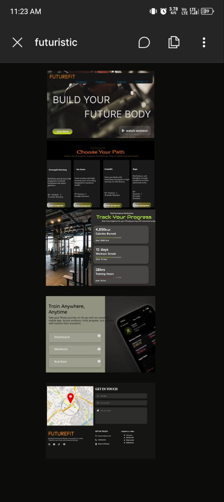
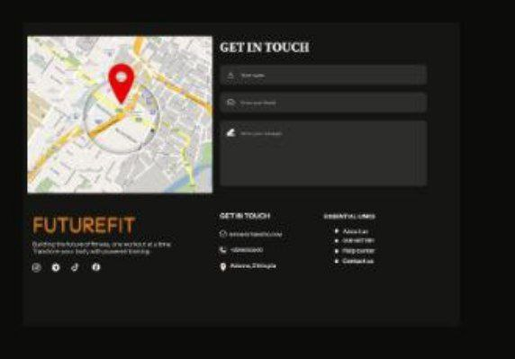
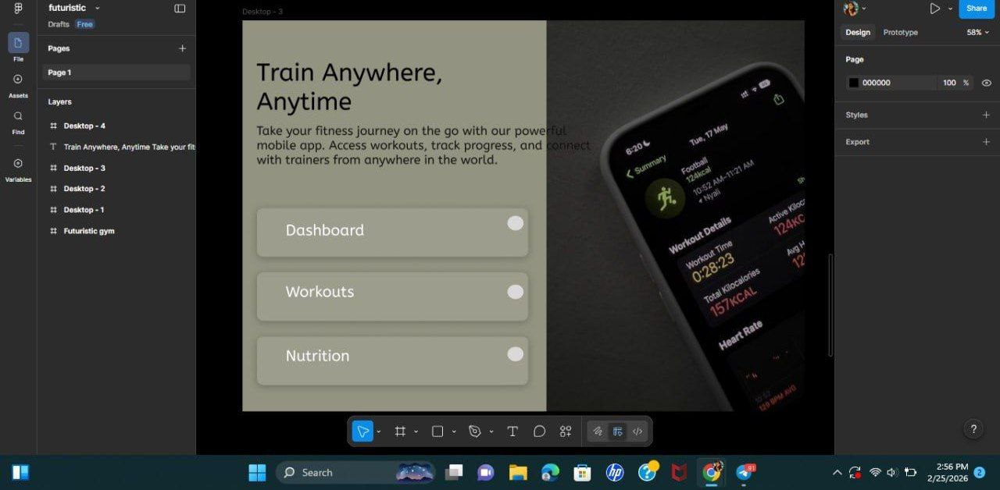

## 📸 Design Preview
Project Overview
This project is a high-conversion website redesign for a personal fitness trainer. The goal is to create a modern, engaging, and user-friendly interface that helps users easily explore programs and book training sessions.
🔍 Problem Analysis
The original fitness website had several usability and conversion issues:
No clear call-to-action to guide users toward booking
Poor visual hierarchy, making content difficult to scan
Lack of structured program information
No motivation or engagement features
Weak user flow from landing to booking
🎯 Objective
The main objective of this redesign is to Which is(old fitness.jpg):
Improve user experience and navigation
Increase conversion through strong CTAs
Present fitness programs in a clear and structured way

### Full Homepage Design

### Contact Section

### Training section

### Tracking progress

